# TASK 1 - Azure: Deploy Frontend to Azure App Service


## Branching and Deployment strategy 

### Branching and Deployment Flow
```
                            ┌────────────┐
                            │  feature/* │ ← your local development
                            └─────┬──────┘
                                  │
                                  ▼
                        ┌────────────────────┐
                        │ deploy to test env │ ← https://testing-flexidev-a5b7bthsd8c7ekgf.australiacentral-01.azurewebsites.net/login
                        └──────────┬─────────┘
                                   │
               [merge/rebase after deploy to test env OK]
                                   │
                                   ▼
                               ┌────────┐
                               │ main   │ ← always production-ready
                               └────┬───┘
                                    │
                              [tag release]
                                    │
                                    ▼
                        ┌────────────────────┐
                        │ tag: v1.2.0        │ ← used for Production deployment: https://production-flexidev-d2e8czhjadgfhzbx.australiacentral-01.azurewebsites.net/login
                        └────────────────────┘
                                     │
                          ┌──────────┴──────────┐
                          │                     │
               [rollback] ▼                     ▼ [hotfix]
         ┌────────────────────┐      ┌────────────────────┐
         │ rollback/v1.2.0    │      │ hotfix/urgent-fix  │
         └────────────────────┘      └────────────────────┘
```

### Develop a feature
```
git checkout main
git pull origin main
git checkout -b feature/my-feature
# ... do work ...
git push origin feature/my-feature
```

### Deploy to test environment
GitHub Actions workflows `.github/workflows/deploy-test-env.yaml` and `.github/workflows/scan-codeql.yaml` will run automatically when a new pull request (PR) is created or new changes are pushed to any `feature/*` branch. <br>
Azure App Service staging: https://testing-flexidev-a5b7bthsd8c7ekgf.australiacentral-01.azurewebsites.net/login

#### ✅ Requirements to Merge into `main`

To merge a PR into the `main` branch, the following three requirements must be fulfilled:

1. ✅ The `.github/workflows/deploy-test-env.yaml` workflow must pass  
   &nbsp;&nbsp;&nbsp;&nbsp;This deploys the code changes to the test environment (Azure App Service named `testing-flexidev`).
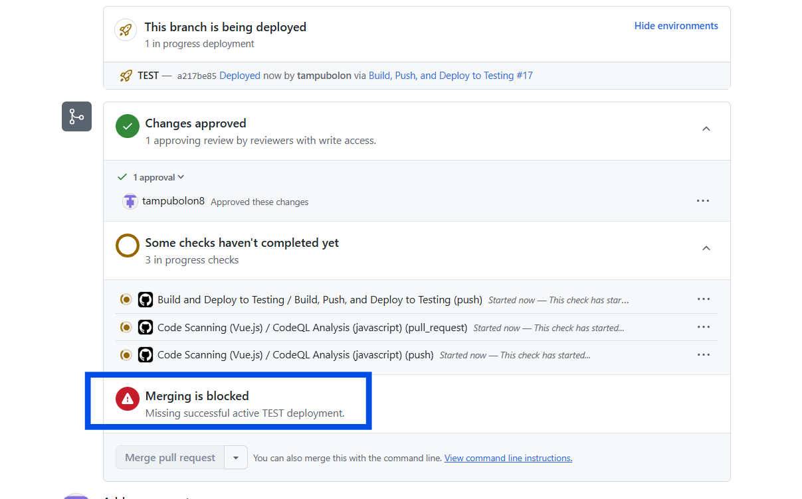 

2. ✅ The `.github/workflows/scan-codeql.yaml` workflow must pass  
   &nbsp;&nbsp;&nbsp;&nbsp;This runs a CodeQL scan to detect potential security vulnerabilities.
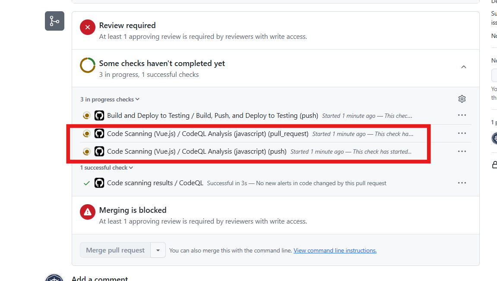   

3. ✅ The PR must receive at least one approval from another engineer.


---

A PR can **only be merged once all three requirements are met.**
#### ✅ PR that **has passed** all checks:
<br><br>


### Deploy to Production
Azure App Service production: https://production-flexidev-d2e8czhjadgfhzbx.australiacentral-01.azurewebsites.net/login <br>
To create new tag for production, run below command:
```
# Create new Tag
git tag -a v1.3.0 -m "Release v1.3.0"
git push origin v1.3.0
```
When new tag is create, `./github/workflows/build-tag.yaml` will be triggered.
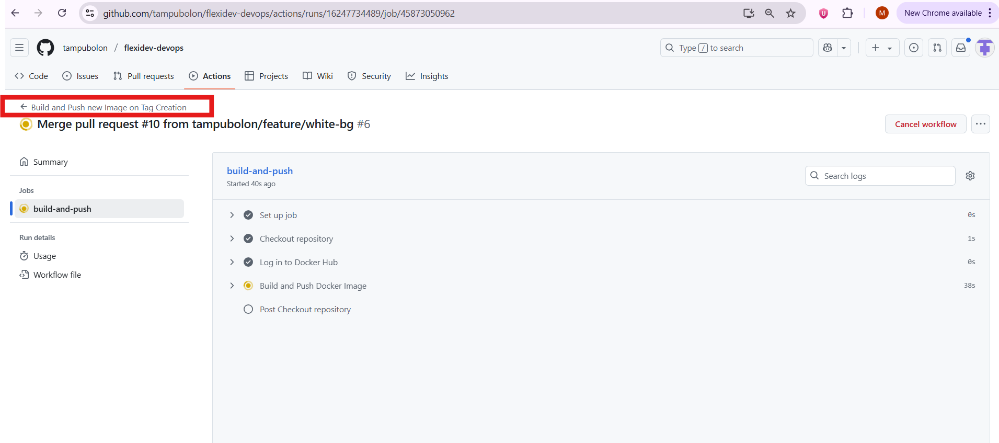


To deploy to production, run Github workflow `/github/workflows/deploy-production-env.yaml`.
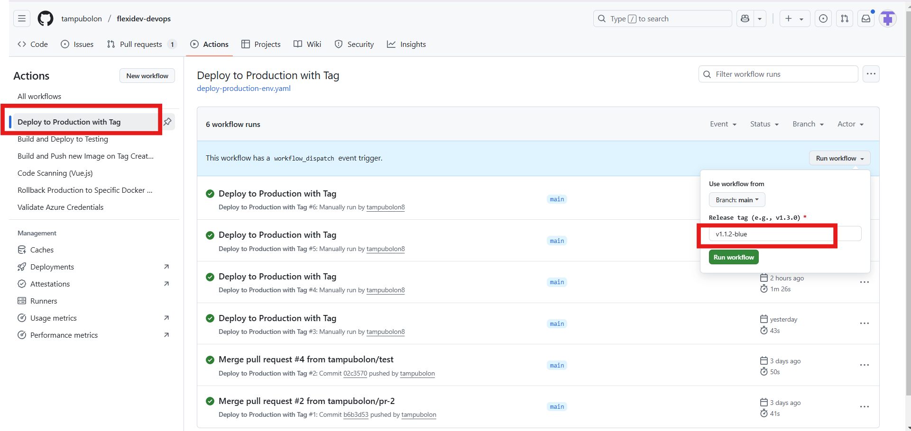
Check available tags [here](https://github.com/tampubolon/flexidev-devops/tags).<br>

See the video below for a demo of the production deployment process.


### 🔁 Rollback to previous version
```
# If v1.2.0 was stable
git checkout tags/v1.2.0 -b rollback/v1.2.0
git push origin rollback/v1.2.0
# CI/CD deploys rollback branch or tag v1.2.0 to production
```
<br><br><br>

# TASK 2 - AWS Network Firewall

## Architecture Diagram
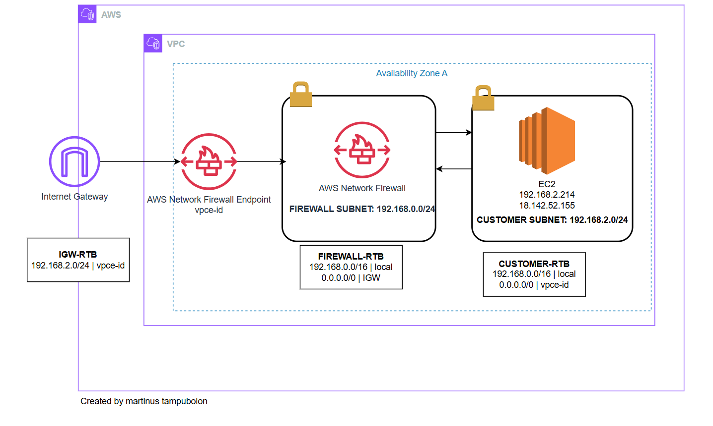


## VPC Screenshot
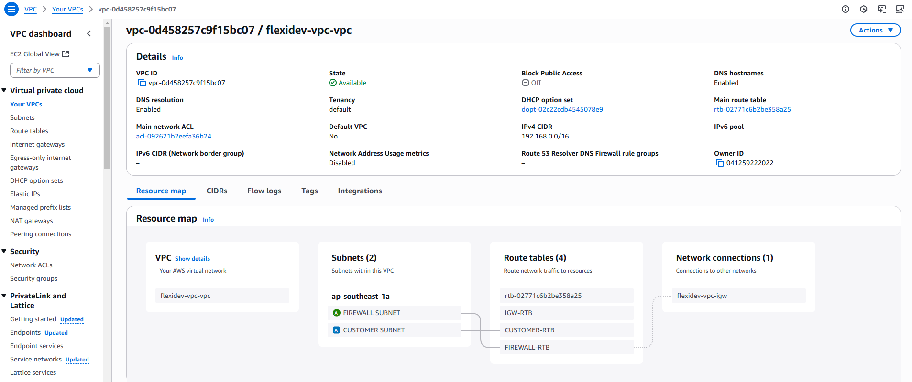

## Subnets Screenshot
### Firewall Subnet
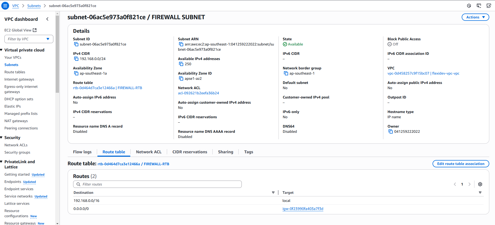

### Customer Subnet


## Route Tables Screenshot
### IGW-RTB
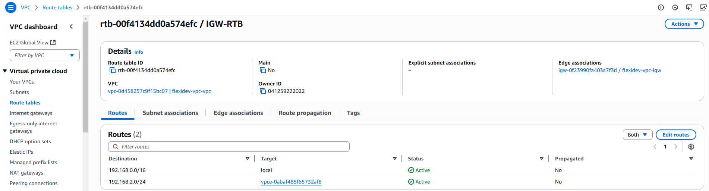
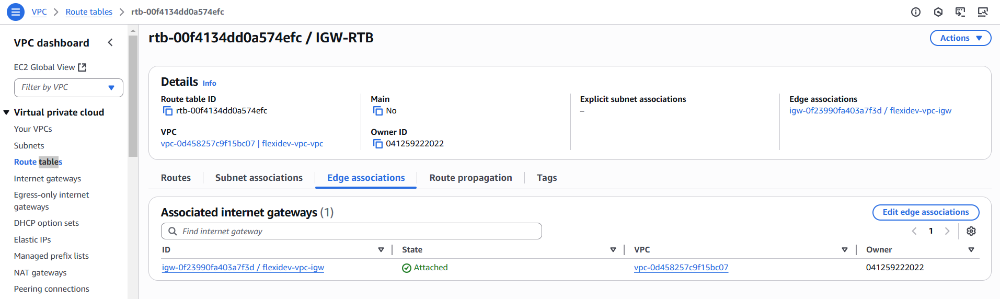

### Firewall-RTB
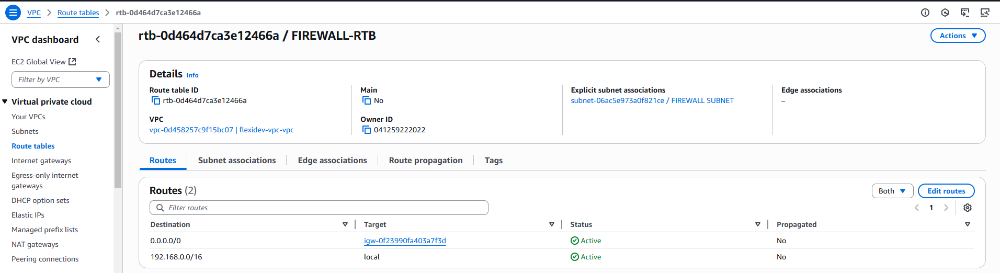

### Customer-RTB
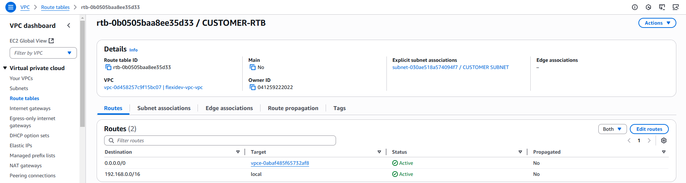

## Network Firewall Screenshot
### Network Firewall Overview Screenshot
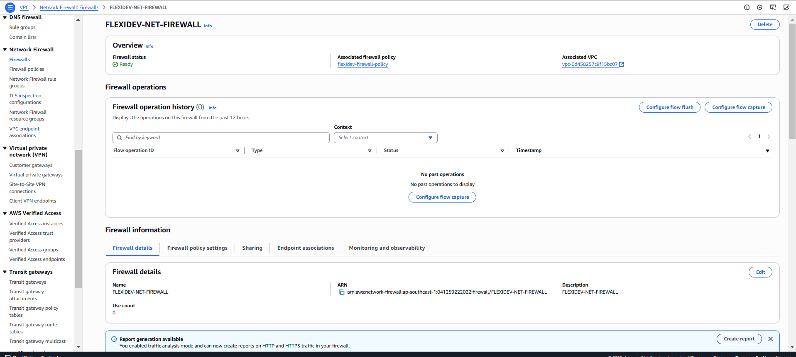
### Network Firewall Policy - Rule Group
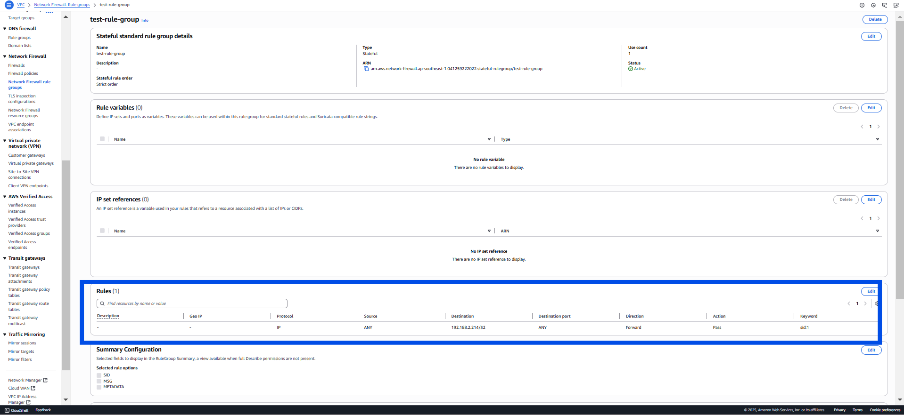<br><br>

## Accessing Nginx Page on EC2 Public IP -- Screen Record
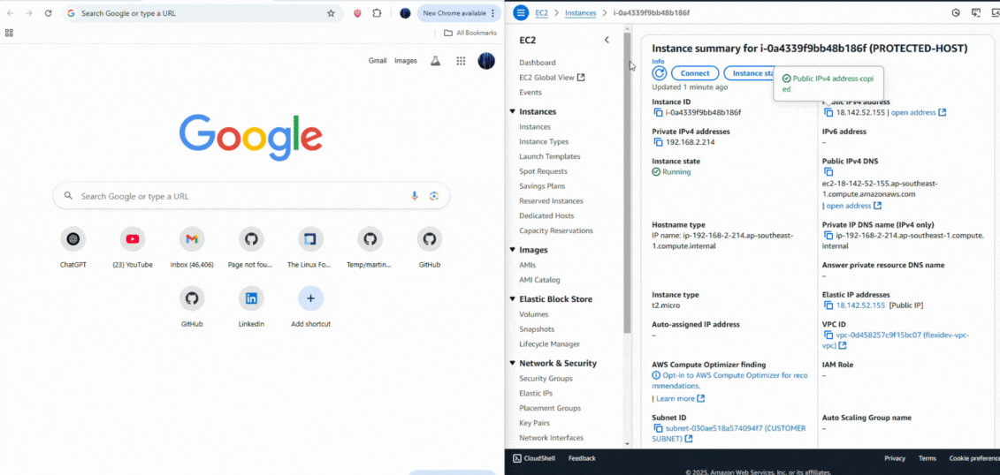<br>

## Run `yum` (`apt`) on EC2 -- Screen Record
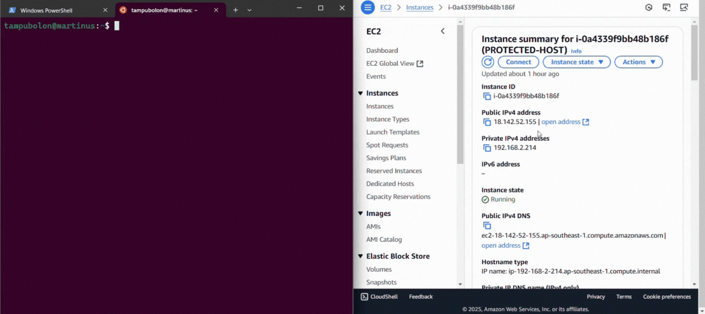<br>


## Network Firewall Monitoring and Logging -- Screen Record
The video below confirms that the network traffic is successfully routed through the AWS Network Firewall.
Traffic flow: `202.65.239.252 => Network Firewall => 192.168.2.214`
<br><br>

## MBTI Test Result
![mbti]](image.png)

