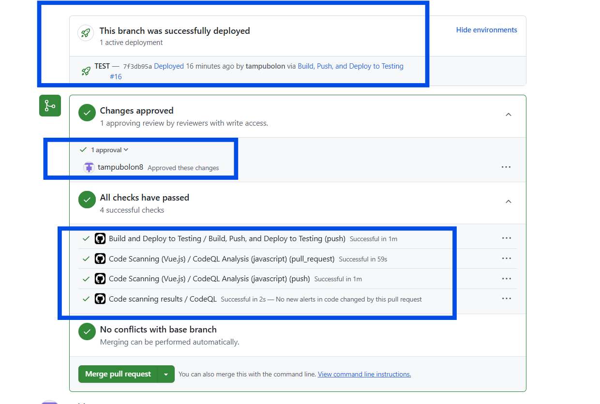

# Portal/Frontend Application


## Branching and Deployment strategy 

### 🚀 Develop a feature
```
git checkout main
git pull origin main
git checkout -b feature/my-feature
# ... do work ...
git push origin feature/my-feature
```

### ✅ Deploy to test environment
```
- Github action workflow `deploy-test-env.yaml` and `scan-codeql.yaml` will run automatically when new PR created or new changes pushed to `feature/*` branch.
- Three requirements must be fulfilled before the PR can be merged into the  `main` branch:
      - ✅ The `deploy-test-env.yaml` workflow must pass. This workflow deploys the code changes to the test environment (Azure App Service named `testing-flexidev`).
      - ✅ The `scan-codeql.yaml` workflow must pass. It runs a CodeQL scan to detect potential security vulnerabilities.
      - ✅ The PR must receive at least one approval from another engineer.
- The PR can only be merged once all three requirements have been successfully met.    
      


```

### Deploy to Production
```

# Tag the release
git tag -a v1.3.0 -m "Release v1.3.0"
git push origin v1.3.0
# CI/CD deploys main or v1.3.0 tag to production
```

### 🔁 Rollback to previous version
```
# If v1.2.0 was stable
git checkout tags/v1.2.0 -b rollback/v1.2.0
git push origin rollback/v1.2.0
# CI/CD deploys rollback branch or tag v1.2.0 to production
```

### Branching and Deployment Flow
```
                            ┌────────────┐
                            │  feature/* │ ← your local development
                            └─────┬──────┘
                                  │
                                  ▼
                        ┌────────────────────┐
                        │ deploy to test env │ ← Az https://testing-flexidev-a5b7bthsd8c7ekgf.australiacentral-01.azurewebsites.net/login
                        └──────────┬─────────┘
                                   │
               [merge/rebase after deploy to test env OK]
                                   │
                                   ▼
                               ┌────────┐
                               │ main   │ ← always production-ready
                               └────┬───┘
                                    │
                              [tag release]
                                    │
                                    ▼
                        ┌────────────────────┐
                        │ tag: v1.3.0        │ ← used for deployment
                        └────────────────────┘
                                     │
                          ┌──────────┴──────────┐
                          │                     │
               [rollback] ▼                     ▼ [hotfix]
         ┌────────────────────┐      ┌────────────────────┐
         │ rollback/v1.2.0    │      │ hotfix/urgent-fix  │
         └────────────────────┘      └────────────────────┘
```